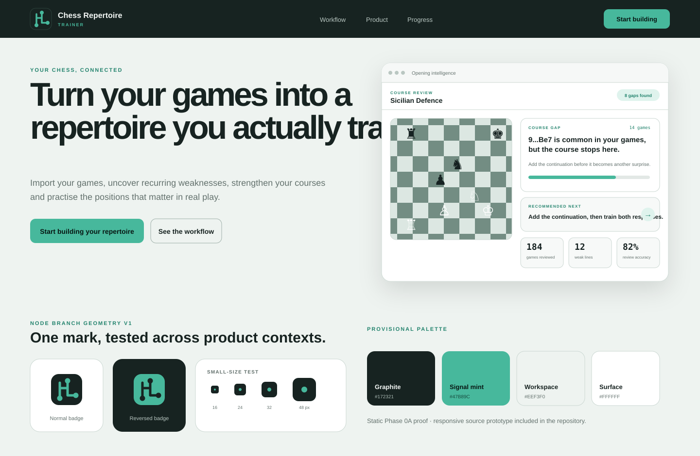

# Phase 0A Landing Proof Report

Date: 2026-07-25

Branch: `visual-transformation/phase-0a-landing-proof`

Base: `visual_transformation`

## Executive summary

This slice creates the first complete visual proof for the Chess Repertoire Trainer transformation. It converts the agreed analytical direction into a production-oriented Node Branch geometry and a responsive landing-page prototype.

The work is deliberately isolated under `transformation/`. It does not change Angular routes, application styles, authentication, API behavior, or the current signed-in shell. The purpose is to review and approve the visual system before Phase 1 turns it into product code.



## Delivered

### Node Branch geometry v1

Three controlled vector assets were created:

- monochrome standalone mark;
- graphite badge with mint geometry;
- reversed mint badge with graphite geometry.

Geometry details:

- `64 × 64` view box;
- rounded-square badge with `16` unit radius;
- `5` unit rounded stroke;
- three `5.5` unit endpoint nodes;
- simple orthogonal branch path;
- no embedded fonts, filters, raster images, external resources, or generated artwork.

This is a technical refinement of the locked Node Branch concept, not a new logo direction. Final optical approval remains open.

### High-fidelity landing-page prototype

The prototype contains:

1. graphite public header and live-text wordmark;
2. product promise and two clear calls to action;
3. realistic opening-intelligence hero composition;
4. import → patterns → repertoire → training → progress workflow;
5. three core capability sections:
   - understand your games;
   - build a practical repertoire;
   - train what matters;
6. contextual progress section;
7. final call to action and footer;
8. responsive desktop, tablet, and mobile compositions.

The interface examples use product concepts verified in the transformation plan: imported games, opening assignment, course gaps, continuation discovery, targeted training, tactical review, and progress.

### Static proof sheet

`proof-sheet.svg` gives pull-request reviewers an immediately visible summary of:

- landing hero direction;
- normal and reversed identity treatments;
- small-size mark test;
- provisional graphite/mint palette.

## Visual rationale

### Identity

The mark is deliberately geometric and technical. It communicates a known position branching into candidate continuations and selected targets without using a generic knight, crown, or chessboard logo.

### Color balance

Graphite is limited to product chrome, high-confidence moments, and the progress section. Most content remains on a quiet light workspace. Mint identifies actions, selected states, progress, and branch targets without coloring every surface.

### Product imagery

The hero uses a board and an actionable course-gap insight rather than generic chess photography. The example demonstrates the product promise directly: a continuation appears frequently in the user's games, the course stops early, and the system recommends what to add and train.

### Surface hierarchy

The prototype uses:

- a flat workspace canvas;
- sections without decorative containers;
- subtle bordered panels for analytical content;
- shadows only for major product compositions and floating status;
- limited radii rather than a uniform card grid.

### Typography

The prototype uses the existing preferred IBM Plex Sans direction through a system fallback stack. Large public headings use tight spacing; analytical values use a monospaced stack.

No font files or font dependency were added.

## How to review

From the repository root:

```bash
python3 -m http.server 4173 --directory transformation/prototypes/phase-0a-landing
```

Open `http://localhost:4173/`.

Recommended viewport review:

- 1440px desktop;
- 1024px compact desktop/tablet;
- 768px tablet;
- 390px mobile.

Review questions:

1. Is the product understandable from the first screen?
2. Does the product feel analytical and modern without becoming corporate?
3. Is the graphite/mint balance correct?
4. Does the hero look like this application rather than a generic chess product?
5. Are the three capability sections the correct public story?
6. Does the Node Branch mark feel strong enough to proceed to production assets?
7. Is the mobile page clear enough despite the amount of product information?

## Validation performed

### Source validation

- Parsed all three SVG files and `proof-sheet.svg` as XML.
- Parsed `index.html` with Python's HTML parser.
- Checked that CSS opening and closing brace counts match.

### Browser rendering

The prototype was rendered locally with Chromium through Playwright at:

- 1440 × 900;
- 1024 × 900;
- 768 × 900;
- 390 × 844.

For all four viewports:

- document scroll width matched viewport width;
- no horizontal overflow was detected;
- the full page rendered successfully;
- desktop and mobile full-page raster captures were inspected during preparation.

### Commands not run

The following repository commands were not run:

```text
npm run build:web
npm run test --workspace=apps/web
npm run lint
npm run check:architecture
```

Reason: this slice changes only static transformation prototype and documentation files. It does not change Angular, TypeScript, package configuration, runtime assets, or architecture boundaries.

## Accessibility considerations included

- semantic sections and headings;
- skip link;
- visible keyboard focus treatment;
- reduced-motion handling;
- descriptive labels for illustrative visual regions;
- decorative brand images use empty alternative text where adjacent live text supplies the name;
- no essential meaning relies on animation.

This is not a complete accessibility audit. Production implementation will still need automated and manual accessibility validation.

## Residual risks and open decisions

- The mark has been tested visually but has not yet been approved as final production geometry.
- Palette values remain provisional until reviewed here and later tested in dense application workflows.
- Exact public copy and section order remain open.
- Illustrative metrics are static examples; Phase 1 must not assume they already exist as one backend payload.
- The prototype uses a system font fallback and does not prove font loading behavior.
- The page has not been integrated with Angular routing, Clerk, analytics, metadata, or real calls to action.
- Warning, danger, engine evaluation, and chart palettes remain outside this checkpoint.
- No automated axe, Lighthouse, or color-contrast audit was run.

## Recommendation

Review this prototype as one coherent system. Apply focused corrections to geometry, palette, density, copy, and composition. Once approved:

1. lock or revise D-301, D-302, and D-303;
2. create the auth-page visualization;
3. create the signed-in home visualization;
4. begin Phase 1 only after those entry-point experiences agree visually.
